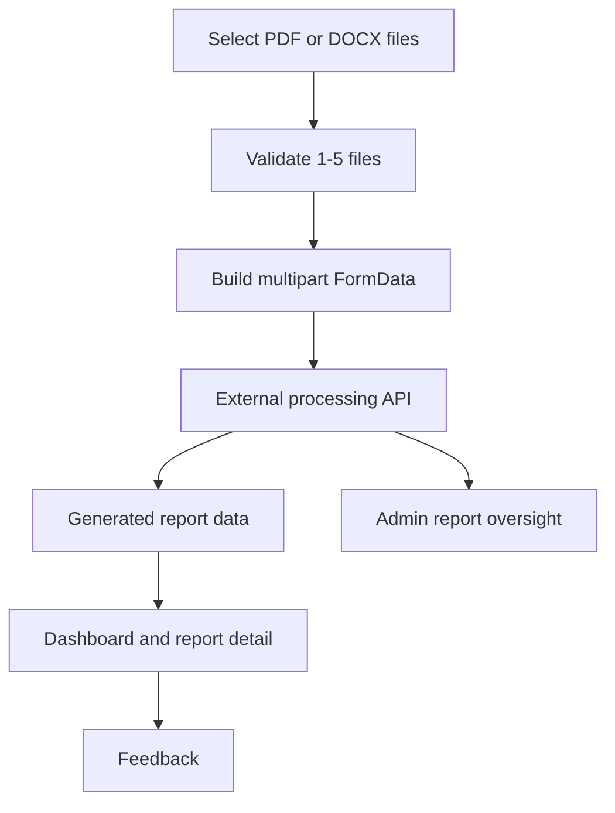
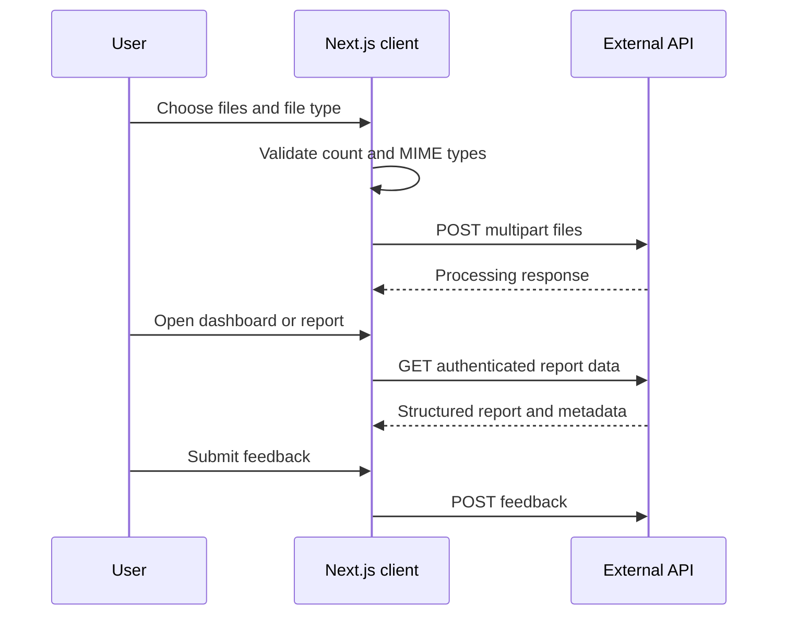

🌐 LIVE: https://infosys-cs.vercel.app/

# InfoSysCS: AI-Powered Qualitative Data Analysis Assistant 🤖

InfoSysCS is a Next.js web client for AI-assisted qualitative research. Researchers can submit PDF or DOCX source files, receive structured analysis reports from the connected service, review report history, and provide feedback. Administrators have separate views for users and platform-wide reports.

The project is technically interesting because it combines a document-upload workflow with authenticated, role-gated report access, a reusable Material UI interface, and a persisted Redux session across a multi-page application.

Repository: [https://github.com/mashfiq-rayhan/InfoSysCs-App](https://github.com/mashfiq-rayhan/InfoSysCs-App)

## Overview

This repository contains the frontend application. Document processing, analysis generation, authentication decisions, and data persistence are provided by an external HTTP API; no backend implementation or database schema is included here.

The implemented client workflow is:

1. A user selects `PDF` or `DOCX` and chooses one to five files.
2. The browser validates the selection and builds a multipart `FormData` payload.
3. The client sends the files to the external `/files/process-data` endpoint.
4. The application uses authenticated report endpoints to connect to, list, and retrieve generated reports.
5. Report details are rendered as structured heading/detail entries, with file metadata, usage metadata, and feedback where supplied by the API.
6. Users review personal reports in the dashboard; authorized administrators review users and global reports.



## Core Features

### Researcher Experience

- **Document upload:** Select multiple files in the browser, with a maximum of five files per submission.
- **PDF and DOCX validation:** Enforces `application/pdf` and the Office Open XML DOCX MIME type before upload.
- **Processing handoff:** Sends files as multipart form data to `/files/process-data?type=pdf|docx`.
- **Report history:** Retrieves a signed-in user's reports from `/reports/me` and displays file counts, file type, names, and creation dates.
- **Report details:** Loads an individual report and renders its structured analysis content, file details, token usage, cost, feedback, and timestamps when returned by the service.
- **Feedback:** Submits a comment and `like` or `dislike` reaction for a report.
- **Terms acknowledgement:** Requires acceptance of the terms-and-conditions checkbox before upload and links to the terms page.

### Authentication and Administration

- **Authentication flow:** Login, registration, logout, cookie-based token lookup, and Google sign-in redirect support are wired through the API layer.
- **Session state:** Redux Toolkit stores authentication status, access token, and user data. `redux-persist` persists the auth slice in browser storage.
- **Protected pages:** Dashboard access is checked through `/auth/me`; admin access is checked through `/auth/admin`.
- **Admin views:** Authenticated administrators can view registered users and global reports, including report metadata, user email, feedback, file names, and file sizes.
- **Shared UI:** Reusable Material UI components cover tables, selects, list containers, loading states, skeletons, alerts, and navigation.

## User Workflow

The main user journey moves from source files to service-generated insights and then to review. The frontend owns input validation, request orchestration, navigation, and presentation; the external service owns the processing and analysis steps.



## Architecture

### Frontend

- **Framework:** Next.js `13.1.6` with the Pages Router and React `18.2.0`.
- **Language:** JavaScript and JSX. This repository does not contain a TypeScript configuration or TypeScript source files.
- **UI:** Material UI 5 with Emotion, a custom theme, global styles, and CSS modules.
- **State:** Redux Toolkit, `next-redux-wrapper`, and `redux-persist`; only the `auth` slice is persisted on the client.
- **API client:** Axios modules in `src/api` centralize calls for auth, users, reports, and uploads.
- **Routing:** File-based routes under `src/pages` cover authentication, dashboard, reports, terms, and administration.

### API Boundary

The client currently targets `http://localhost:3050/api/v1` directly. The API modules expose these operations:

| Area    | Client operations                                                                                           |
| ------- | ----------------------------------------------------------------------------------------------------------- |
| Auth    | `GET /auth/me`, `GET /auth/admin`, `POST /auth/login`, `POST /auth/logout`, Google auth redirect            |
| Users   | `POST /users`, `GET /users`                                                                                 |
| Upload  | `POST /files/process-data?type=pdf` or `type=docx`, `POST /files/check`                                     |
| Reports | `POST /reports/connect`, `GET /reports/me`, `GET /reports`, `GET /reports/:refId`, `POST /reports/feedback` |

Requests use credentials and bearer authorization where required. Authorization is enforced by the connected service and its `/auth/admin` check; the frontend does not define a local role enum or permission policy.

### Project Structure

```text
src/
├── api/              # Axios service modules for the external API
├── components/       # Feature and shared UI components
│   ├── Admin/        # User and global report administration views
│   ├── Auth/         # Login, registration, and auth modal flows
│   ├── Dashboard/    # User dashboard and report history
│   ├── FileUploader/ # Upload form and processing state
│   ├── Navigation/   # Layout, navigation, profile, and footer
│   ├── Report/       # Report display and feedback
│   └── UI/            # Shared tables, selects, lists, loading, and alerts
├── pages/            # Next.js Pages Router routes
├── store/            # Redux store and auth slice
├── styles/           # Global and CSS module styles
├── theme/            # Material UI theme
└── utils/            # File validation and shared helpers
public/               # Static images, terms data, and document assets
```

## Getting Started

### Prerequisites

- Node.js with npm
- A running compatible backend at `http://localhost:3050/api/v1`

### Install and Run

```bash
npm install
npm run dev
```

Open [http://localhost:3000](http://localhost:3000).

### Build and Start

```bash
npm run build
npm start
```

### Lint

```bash
npm run lint
```

## Configuration and Deployment Notes

The current repository has no environment example, runtime configuration, Dockerfile, CI/CD workflow, hosting manifest, or production API URL. The API base URL is hard-coded in the Axios modules, so a production deployment would require an accompanying backend and an environment/configuration change before it could be described as production-ready.

## Scope of This Repository

The `openai` package is declared as a dependency, but no frontend source file imports it or calls an LLM. Likewise, there is no local PDF/DOCX parser, database driver, ORM, schema, migration, report export, or download implementation in this checkout. Those capabilities should be attributed to the external service only when its implementation and deployment are documented separately.

## License

No license file is included in this repository.
